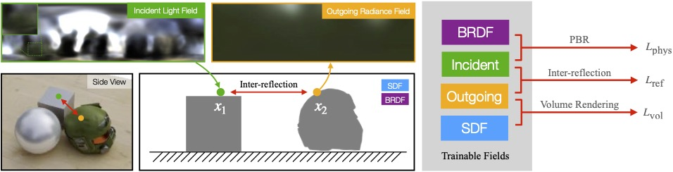

# NeILF++: Inter-Reflectable Light Fields for Geometry and Material Estimation

This software project accompanies the research paper, [NeILF++: Inter-Reflectable Light Fields for Geometry and Material Estimation](https://arxiv.org/abs/2303.17147) (ICCV 2023) and can be used to reproduce the results in the paper.

<p align="center">
  
</p>

## Introduction 
[NeILF++](https://arxiv.org/abs/2303.17147) is a differentiable rendering framework for joint geometry, material and lighting estimation from multi-view images. More details can be found in the [project webpage](https://yoyo000.github.io/NeILF_pp/). If you find this project useful for your research, please cite:
```
@inproceedings{zhang2023neilfpp,
    title={NeILF++: Inter-Reflectable Light Fields for Geometry and Material Estimation},
    author={Jingyang Zhang and Yao Yao and Shiwei Li and Jingbo Liu and Tian Fang and David McKinnon and Yanghai Tsin and Long Quan},
    booktitle={International Conference on Computer Vision (ICCV)},
    year={2023}
}
```

## Getting Started

### Environment Setup

Install cuda 11.6 and conda then:
```
conda create -y -n neilfpp python=3.10
conda activate neilfpp
conda install -y pytorch==1.12.1 torchvision==0.13.1 cudatoolkit=11.6 -c pytorch -c conda-forge
conda install -y matplotlib numpy pybind11
conda install -y openexr-python -c conda-forge
pip install --no-input lpips opencv-python open3d tqdm imageio scikit-image scikit-learn trimesh pyexr
imageio_download_bin freeimage
# tcnn v1.6, please also refer to the official installation guide
pip install git+https://github.com/NVlabs/tiny-cuda-nn@8e6e242#subdirectory=bindings/torch
```

If you would like to test the synthetic dataset which use fixed mesh, additionally do:
```
# OptiX, please manually download the installer
sh NVIDIA-OptiX-SDK-7.3.0-linux64-x86_64.sh --include-subdir --skip-license --prefix=<install_dir>

# cudnn
OS=ubuntu2004 # CHANGE TO YOUR VERSION
wget https://developer.download.nvidia.com/compute/cuda/repos/${OS}/x86_64/cuda-${OS}.pin
mv cuda-${OS}.pin /etc/apt/preferences.d/cuda-repository-pin-600
apt-key adv --fetch-keys https://developer.download.nvidia.com/compute/cuda/repos/${OS}/x86_64/3bf863cc.pub
apt install -y software-properties-common cmake
add-apt-repository "deb https://developer.download.nvidia.com/compute/cuda/repos/${OS}/x86_64/ /"
apt update
apt -y install libcudnn8=8.4.1.50-1+cuda11.6 libcudnn8-dev=8.4.1.50-1+cuda11.6

# compile the python binding
cd code/pyrt
mkdir -p build
cd build
export OptiX_INSTALL_DIR=/path/to/NVIDIA-OptiX-SDK-7.3.0-linux64-x86_64
export PATH=$PATH:/usr/local/cuda-11.6/bin
export Torch_DIR=$CONDA_PREFIX/lib/python3.10/site-packages/torch/share/cmake/Torch
cmake ..
make pyrt
ln -s pyrt/build/pyrt.cpython-310-x86_64-linux-gnu.so ../../
```

### Download
Download the synthetic dataset, the preprocessed DTU dataset and the HDR dataset from [here](https://apple.box.com/s/2ulz3kjtca53aj3qlwjwyv27zfuug2x5). Note that for the synthetic dataset, all scenes shares the same geometry files and the BRDF ground truths. We only provide the geometry files and the BRDF GT in `synthetic_city`, and users may structure the input of another scene by substituting the image folder (`synthetic_city/inputs/images`) to another input image folder.

The pretrained checkpoints for the experiments in the paper are also in the link. 

### Optimization
Download the datasets used in the paper (synthetic, DTU, and HDR). Choose one scene and run the following:
```
python training/train.py DATA_FOLDER OUTPUT_FOLDER --config_path CONFIG_PATH --phase geo,mat,joint
```
Where `DATA_FOLDER` is the structured input data folder, `OUTPUT_FOLDER` is the output folder, and `CONFIG_PATH` is the path to the config file of all parameters. 

We provide seperate configs for synthetic/HDR/DTU datasets (see provided `configs/` in the codebase). If you encounter the out-of-memory issue, please decrease the `train.num_pixel_samples` in the config file.

### BRDF Export
Make sure you have correct texture atlas input before adding `--export_brdf`. Results will be stored in `OUTPUT_FOLDER/evaluation`:
```
python evaluation/evaluate.py DATA_FOLDER OUTPUT_FOLDER --config_path CONFIG_PATH --export_brdf
```

You can also pass `--eval_nvs` for novel view rendering evaluation and `--eval_brdf` for BRDF quality evaluation (if GT BRDF is provided). The PSNR scores will be recorded and stored in `OUTPUT_FOLDER/evaluation/report_evaluation.json`.

## File Formats

Input data should be structured into the following:
```
.                          
├── inputs      
│   ├── images
│   ├── position_maps (optional)
│   ├── depth_maps (optional)
│   ├── normal_maps (optional)
│   ├── model (optional)
│   │   ├── components of a textured mesh (synthetic dataset)
│   │   └── oriented_pcd.ply (other datasets)
│   └── sfm_scene.json   
│      
└── ground_truths (optional)
    └── materials 
        ├── kd
        ├── roughness
        └── metallic       
```
### Camera Input
The `sfm_scene.json` file is used to stored the metadata and the SfM result of a scene. Please refer to `load_cams_from_sfmscene` in `utilts/io.py` for details.
* Camera intrinsics are stored in `sfm_scene['camera_track_map']['images']['INDEX']['intrinsic']`
* Camera extrinsics are stored in `sfm_scene['camera_track_map']['images']['INDEX']['extrinsic']`
* Image list are stored in `sfm_scene['image_list']['file_paths']`. (image index -> image path)
* The bounding box transformation is stored in `sfm_scene['bbox']['transform']`, which can transform the eight bounding box corners to normalized points at `{1/-1, 1/-1, 1/-1}`. It is used to compute the scale mat for coordinate normalization.
* Other fields could be ignored.

### Image Input
The image names should be stored in `sfm_scene['image_list']['file_paths']`. You can use `.jpg` and `.png` formats for LDR inputs, or `.exr` and `.tiff` formats for HDR inputs. 

### Geometry Input
Geometry input is required by the synthetic dataset. The geometry input should be provided as either the rendered position map at each view (in `inputs/position_maps`) or the rendered depth map at each view (in `inputs/depth_maps`). For other datasets, an oriented point cloud is preferred (in `inputs/model/oriented_pcd.ply`). 

### Texture Input (for BRDF Export)
The position atlas should be provided for exporting BRDF texture maps. (in `inputs/model/pos_tex`, see sample data for details)

## License
This sample code is released under the [LICENSE](LICENSE) terms. The Synthetic dataset is released under the [DATASET_LICENSE](DATASET_LICENSE)
